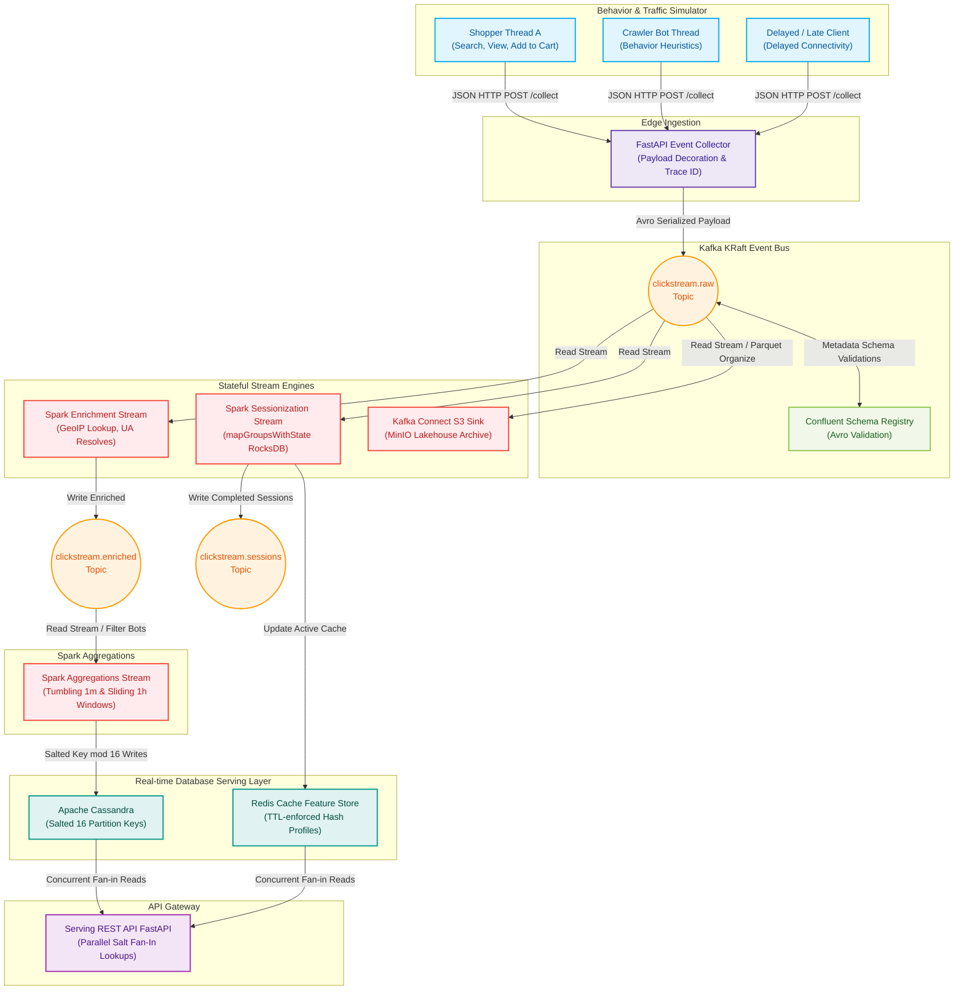

# Real-time E-commerce Clickstream Analytics Pipeline

A production-grade, highly-available, and resilient **Kappa Architecture clickstream analytics pipeline** designed to process massive user interaction streams from high-traffic e-commerce marketplaces in real-time. It captures, enriches, sessionizes, and aggregates user events (page views, searches, cart additions, and checkouts) to drive live business dashboards and serve low-latency features for downstream machine learning and personalization engines.

---

## 1. Executive Summary & Business Use Case

In modern e-commerce, user behavior data is highly time-sensitive. A clickstream event is most valuable in the seconds immediately following the action. This pipeline addresses two core business mandates:
1. **Real-time Operational Visibility**: Tracking GMV, inventory burn rates during flash sales, category conversion funnels, and trending products by the minute.
2. **Real-time Personalization & Retargeting**: Fetching a user's current session features (e.g., category affinity, search intent, shopping cart status) in `< 10ms` to feed a real-time ML bidder or recommendation service within seconds of browsing activity.

### Performance & SLA Targets:
- **System Throughput**: Designed to scale to `50,000 events/sec` peak.
- **End-to-End Latency**: `< 2.5 seconds` from browser event generation to Cassandra OLAP update (P99).
- **Feature Serving Latency**: Sub-`10ms` P99 retrieval time from the Redis serving layer.

---

## 2. In-Depth System Architecture

This pipeline is built on the **Kappa Architecture** paradigm, where all processing is executed as streams over a unified event log.



### 2.1 Component Specifications

#### A. FastAPI Edge Collector
The edge collector acts as a high-throughput gateway. It is implemented in FastAPI due to its asynchronous performance (Uvicorn event loops) and native integration with Pydantic for validation.
- **Payload Decoration**: Attaches a unique, trace-ready UUID v4 `event_id` and a `server_timestamp` to mark the exact ingestion time.
- **Idempotence**: The Kafka Producer is configured with `enable.idempotence=True`, `acks=all`, and a high retry budget to ensure no event is duplicated or lost between the collector and the broker.
- **Batching & Compression**: Optimized with Snappy compression and `linger.ms=20` to aggregate payloads into efficient, high-density packets, minimizing network I/O.

#### B. Avro Schema Validation & Evolution
All events are serialized using **Apache Avro** and governed by the **Confluent Schema Registry** to guarantee schema safety.
- **Schema Compatibility**: Set to `BACKWARD` compatibility mode. This ensures that new fields added to events must be nullable or have default values, allowing downstream consumers to process events seamlessly without crashing.
- **Topic Naming Strategy**: Registry records map to `clickstream.raw-value`.

#### C. PySpark Enrichment Stream
Reads from `clickstream.raw`, parses JSON/Avro envelopes, and applies UDFs:
- **Bot Detection Heuristics**: Applies high-speed regular expressions to incoming User-Agents to classify crawler traffic (e.g. Googlebot, indexers). Bot events are tagged with `is_bot=true` and filtered out of downstream aggregations while kept in the raw archive for security audits.
- **GeoIP Resolution**: Maps client IP addresses to country codes using a broadcasted MaxMind database coordinate lookup.
- **User-Agent Parsing**: Translates raw strings into clean device, operating system, and browser categories.

#### D. PySpark Stateful Sessionization
Tracks active customer journeys using stateful stream processing via Spark's `mapGroupsWithState` API:
- **RocksDB State Store Backend**: Instead of using the default JVM garbage-collected heap, state is stored in an off-heap RocksDB database on each executor. This allows managing millions of concurrent user states without garbage collection pauses.
- **Timeout Management**: Evaluates client event timestamps. If a user remains inactive for 30 minutes, an event-time timeout is triggered. The session state containing metrics like `{session_duration, event_count, conversion_status, page_history}` is finalized, published to `clickstream.sessions`, and written to Redis.
- **Redis Sync Pipeline**: While sessions are active, Spark performs high-speed pipelined writes to Redis, updating the session attributes under a 2-hour TTL.

#### E. PySpark Windowed Aggregations & Watermarking
Computes rolling analytics over client event time:
- **Watermarking**: Declares a `5-minute watermark` (`withWatermark("event_time", "5 minutes")`). Events arriving more than 5 minutes past the current watermark are classified as late.
- **Late Data Routing**: Normal late events are merged into the currently running windows; extremely late events (devices coming back online after hours) bypass the aggregation window and are routed to a `late-events` DLQ topic for offline reconciliation.
- **Tumbling & Sliding Windows**: Computes 1-minute tumbling aggregates for live product view counts and 1-hour sliding conversion metrics.

#### F. Apache Cassandra Salted Storage
During flash sales, a popular SKU (e.g., `prod_phone12`) creates a massive write bottleneck on a single Cassandra partition. We eliminate this hotspot using **Modulo-16 Salting**:
- **Write Path**: Spark calculates a partition salt: `salt_bucket = hash(event_id) % 16`. The composite partition key is defined as `PRIMARY KEY ((product_id, salt_bucket), window_start)`.
- **Read Path**: The Serving API queries all 16 salted buckets in parallel using asynchronous, non-blocking connection threads, and sums the records before returning the final response, avoiding hotspot overhead completely.

---

## 3. Data Model & Database Schemas

### 3.1 Apache Cassandra CQL Schemas
We implement query-first, highly denormalized schemas.

```sql
CREATE KEYSPACE IF NOT EXISTS clickstream_analytics
WITH replication = {'class': 'SimpleStrategy', 'replication_factor': 3};

USE clickstream_analytics;

-- Salted Table for 1-minute product aggregation (Flash-sale proof)
CREATE TABLE IF NOT EXISTS agg_by_product_1m (
    product_id text,
    salt_bucket int,
    window_start timestamp,
    window_end timestamp,
    page_views_count counter,
    adds_to_cart_count counter,
    purchases_count counter,
    PRIMARY KEY ((product_id, salt_bucket), window_start)
) WITH CLUSTERING ORDER BY (window_start DESC);

-- Category Aggregations Table (1-hour window)
CREATE TABLE IF NOT EXISTS agg_by_category_1h (
    category_id text,
    window_start timestamp,
    window_end timestamp,
    page_views_count counter,
    purchases_count counter,
    PRIMARY KEY (category_id, window_start)
) WITH CLUSTERING ORDER BY (window_start DESC);

-- User Completed Sessions Table
CREATE TABLE IF NOT EXISTS sessions_by_user (
    user_id text,
    session_id text,
    session_start_ts timestamp,
    session_duration_sec int,
    event_count int,
    is_purchased boolean,
    PRIMARY KEY (user_id, session_start_ts)
) WITH CLUSTERING ORDER BY (session_start_ts DESC);
```

### 3.2 Redis Cache Key Structures
Redis is used as a sub-10ms feature store:
- **Key**: `session:{session_id}` (Type: Hash)
  - Fields:
    - `user_id`: "usr_82392"
    - `event_count`: "14"
    - `is_purchased`: "True"
    - `last_activity_timestamp`: "1779537600000"
    - `affinity_category`: "electronics"
  - **TTL**: `7200` (2 hours sliding expiration).

---

## 4. Complete Installation & Setup Guide

### 4.1 Prerequisites
Ensure your local development environment has:
- **Docker & Docker Compose** (v2.0+)
- **Python** (v3.10+)
- **Java JDK 11** (Required for Spark local submission)
- **Apache Spark 3.5.x** configured on your local system PATH.

---

### 4.2 Step-by-Step Setup

#### Step 1: Clone the Project
```bash
git clone https://github.com/PSURI1894/Real-time-E-commerce-Clickstream-Analytics-Pipeline.git
cd Real-time-E-commerce-Clickstream-Analytics-Pipeline
```

#### Step 2: Start the Docker Infrastructure Containers
Launch all system database, message broker, registry, and coordinator services in the background:
```bash
make up
```
This runs Zookeeper, Kafka, Schema Registry, Cassandra, Redis, MinIO, Prometheus, and Grafana.

#### Step 3: Validate Container Health
Wait about 15-20 seconds and verify that all services are online and healthy:
```bash
make ps
```

#### Step 4: Register Avro Event Schemas
Submit the Clickstream event schemas to the confluent schema registry:
```bash
python schemas/register_schemas.py
```

#### Step 5: Start the Edge Event Collector
Start the asynchronous event receiver API:
```bash
make run-collector
```
The gateway is now active on `http://localhost:8000`. You can inspect the interactive OpenAPI endpoints at `http://localhost:8000/docs`.

#### Step 6: Deploy PySpark Structured Streaming Jobs
Deploy the enrichment stream to parse and validate raw clicks:
```bash
make run-enrichment
```

Deploy the aggregation stream to calculate windowed metrics and update the Cassandra/Redis databases:
```bash
make run-aggregations
```

#### Step 7: Launch the Shopper Traffic Simulator
In a separate terminal, launch the multithreaded shopper traffic generator to start streaming data into the pipeline:
```bash
make simulator
```
This simulates threads of active shoppers browsing categories, searching for items, adding products to carts, checking out, and producing crawler bot signatures.

#### Step 8: Start the REST Serving API
Launch the API serving layer to fetch real-time features and metrics:
```bash
make run-api
```
The REST API starts listening on `http://localhost:8082`.
- Query real-time active session profiles from Redis:
  ```bash
  curl http://localhost:8082/api/sessions/{session_id}
  ```
- Query top-trending product OLAP metrics from Cassandra:
  ```bash
  curl http://localhost:8082/api/products/trending
  ```

---

## 5. Observability & Prometheus Alerting Rules

Telemetries are collected from all JVM, Python, database, and system brokers.

### 5.1 Prometheus Scrape Configurations
Add the target services in your Prometheus scrape configuration:
```yaml
global:
  scrape_interval: 15s

scrape_configs:
  - job_name: 'edge-collector-metrics'
    static_configs:
      - targets: ['collector:8000']

  - job_name: 'spark-executors'
    static_configs:
      - targets: ['spark-master:8080']

  - job_name: 'cassandra-metrics'
    static_configs:
      - targets: ['cassandra:7070']
```

### 5.2 Prometheus Alert Rules
The alerting rules are configured in `docker/prometheus/alert_rules.yml` to trigger PagerDuty alerts under critical pipeline lag conditions:

```yaml
groups:
  - name: clickstream-pipeline-alerts
    rules:
      # Alert if consumer lag exceeds 100,000 messages (backpressure alert)
      - alert: HighConsumerLag
        expr: kafka_consumergroup_lag{group="clickstream-enrichment"} > 100000
        for: 2m
        labels:
          severity: critical
        annotations:
          summary: "High consumer lag detected on Clickstream Pipeline"
          description: "Enrichment stream is falling behind Kafka producer rate by {{ $value }} messages."

      # Alert if Spark micro-batch processing duration exceeds 30 seconds
      - alert: SparkBatchProcessingDelay
        expr: spark_batch_duration_seconds > 30
        for: 5m
        labels:
          severity: warning
        annotations:
          summary: "Spark micro-batch execution is delayed"
          description: "Executor processing times are currently {{ $value }} seconds, exceeding trigger limits."
```

---

## 6. Troubleshooting & Common Failures

### 6.1 Cassandra Container Timeout Issues
- **Problem**: When starting up via `make up`, the Cassandra container crashes or refuses connection requests.
- **Cause**: On Windows hosts, Cassandra requires significant startup time to allocate JVM memory tables and can fail the initial health check.
- **Solution**: Increase memory allocation in Docker Desktop. If the connection fails, manually verify status using:
  ```bash
  docker exec -it clickstream-cassandra nodetool status
  ```

### 6.2 Spark Checkpoint Directory Locks
- **Problem**: Spark jobs fail to start, throwing directory write exceptions or metadata locking errors.
- **Cause**: Re-starting local PySpark streams without clearing previous checkpoints causes lock metadata conflicts.
- **Solution**: Clear previous checkpoint folders using the Makefile cleaning task:
  ```bash
  make clean
  ```

### 6.3 Confluent Schema Compatibility Failures
- **Problem**: The schema registration script throws a `422 Unprocessable Entity` or `Incompatible Schema` error.
- **Cause**: A modification was made to one of the Avro files that broke backward compatibility (e.g., renaming a field or removing a required field).
- **Solution**: Add new fields only as optional, nullable entries (using union `["null", "string"]` and setting a `default: null`). If a breaking rename is mandatory, register the schema under a new subject version topic (e.g. `clickstream.raw-v2`).
